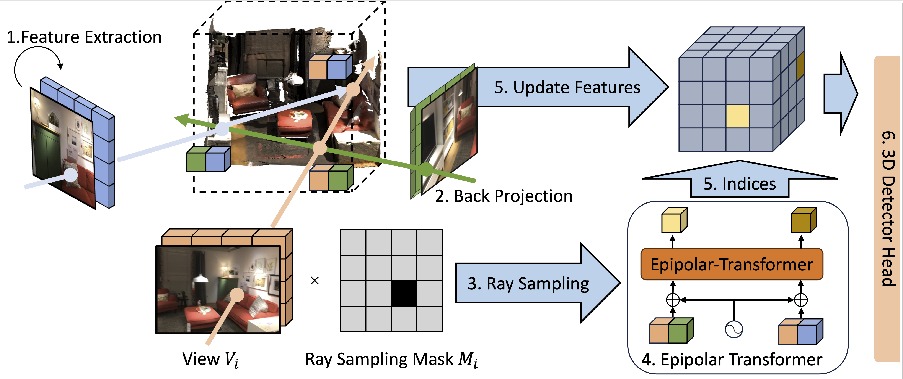

**ImVoxelENet: Image to Voxels Epipolar Transformer for Multi-View RGB-based 3D Object Detection**


This repository contains implementation of the multi-view 3D object detector ImVoxelENet, our implement are mainly in these files:

```
mmdet3d/models/detectors/mv_det.py
configs/imvoxelnet/mvdet.py
```


<p align="center"></p>

### Installation

This implementation is based on [mmdetection3d](https://github.com/open-mmlab/mmdetection3d) framework.
Please refer to the original installation guide [install.md](docs/install.md), replacing `open-mmlab/mmdetection3d` with `saic-vul/imvoxelnet`.
Also, [rotated_iou](https://github.com/lilanxiao/Rotated_IoU) should be installed with [these](https://github.com/saic-vul/imvoxelnet/blob/master/docker/Dockerfile#L31-L34) 4 commands.

Most of the `ImVoxelNet`-related code locates in the following files:

```mmdet3d/models/detectors/mv_det.py
mmdet3d/models/detectors/mv_det.py
configs/imvoxelnet/mvdet.py
```

### Datasets

For **ScanNet** please follow instructions in [scannet](data/scannet).

### Getting Started

Please see [getting_started.md](docs/getting_started.md) for basic usage examples.

**Training**

To start training, run [dist_train](tools/dist_train.sh) with `ImVoxelNet` [configs](configs/imvoxelnet):

```shell
bash tools/dist_train.sh configs/imvoxelnet/mvdet.py 8
```

**Testing**

Test pre-trained model using [dist_test](tools/dist_test.sh) with `ImVoxelNet` [configs](configs/imvoxelnet):

```shell
bash tools/dist_test.sh configs/imvoxelnet/mvdet.py \
    work_dirs/mvdet/latest.pth 8 --eval mAP
```
